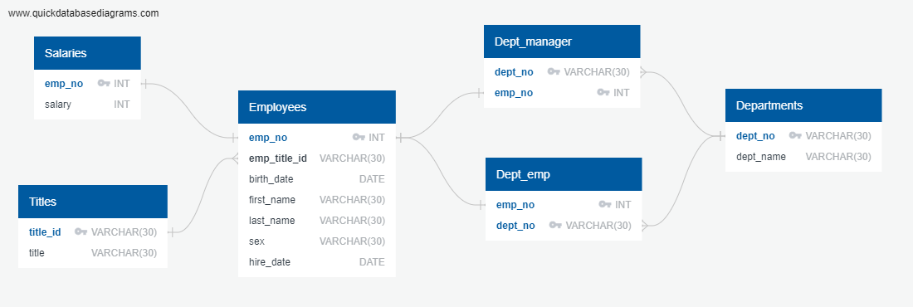
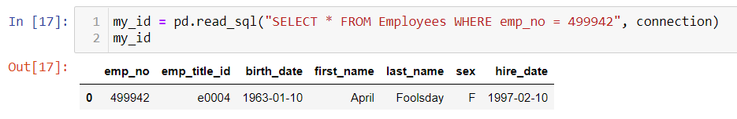

# sql-challenge | Homework 09 - SQL

## Results

- File `09-SQL_schemata` contains the table definitions and visualitions. They must be created following the order of appearance.
- File `09-SQL_queries` contains the queries used to answer the homework questions. 
- The Entity Relationship Diagram (ERD) is presented bellow:

- File `Employee_JupyterNB.ipynb` contains the solution for the bonus part.
- The "Search your ID number" result is presented bellow:

## NOTE
A `config.py` file (not included for security reasons) is required to execute the Jupyter Notebook.